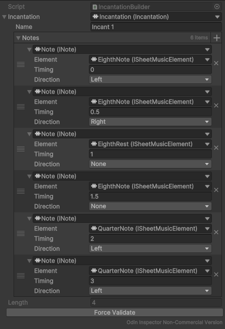
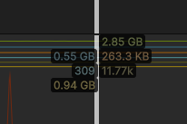
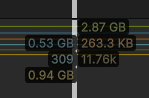
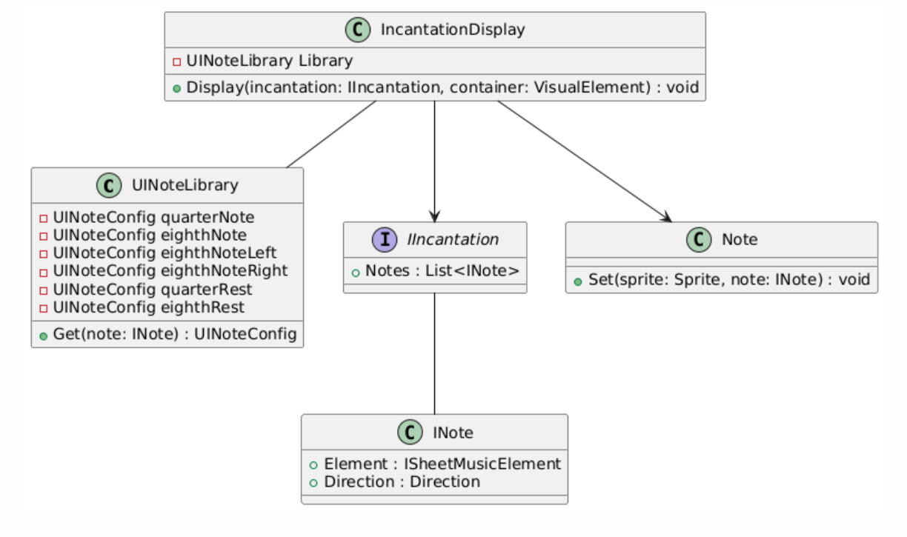
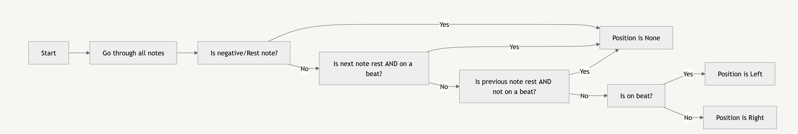
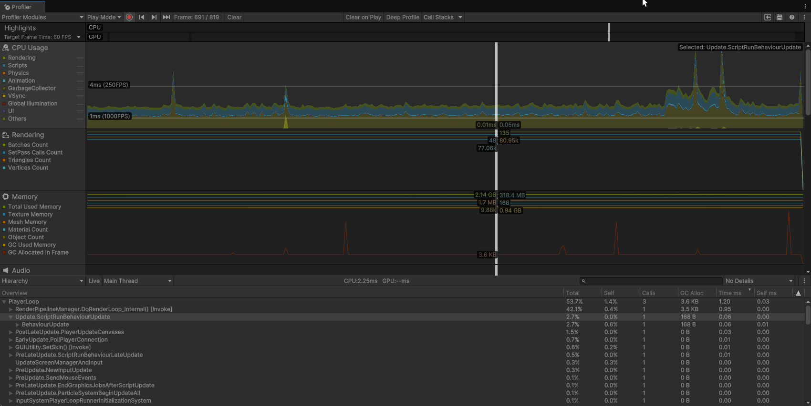
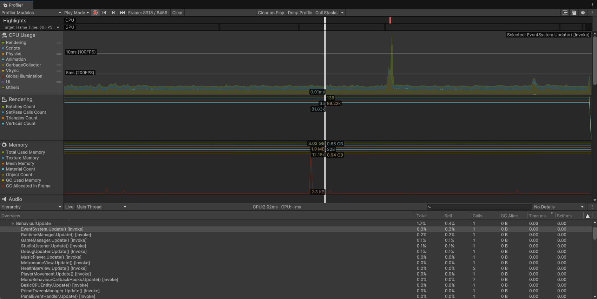

# Prerequisite Packages

There are some packages you will need to install manually.

## FMOD

You can get the FMOD package from
the [Unity Asset Store](https://assetstore.unity.com/packages/tools/audio/fmod-for-unity-161631).

#### FMOD Studio

If you would like to edit the FMOD project, you will need to download FMOD Studio from
the [FMOD website](https://www.fmod.com/download#fmodstudio).

### Setup

After importing the package into Unity, FMOD will open the setup wizard:

1. Open the Sample Scene in `Assets/_Project/Scenes/Sample Scene.unity`.
2. Open the wizard again (`FMOD > Setup Wizard`).
3. In the **Linking** section, click **FMOD Studio Project**, and navigate to `FMOD/FMOD.fspro`.
4. Run through the rest of the wizard, and you're good to go!

## Odin

You can get Odin via the [educational license](https://odininspector.com/educational/ontario-tech-university) or
from the Unity Asset Store ([Inspector & Serializer](https://assetstore.unity.com/packages/tools/utilities/odin-inspector-and-serializer-89041) and [Validator](https://assetstore.unity.com/packages/tools/utilities/odin-validator-227861)).

You will need the inspector, serializer and validator

### Setup

There's minimal setup. After opening the project, simply import the ```.unitypackage``` and go through the basic setup

## PrimeTween
Pick it up from [here](https://assetstore.unity.com/packages/tools/animation/primetween-high-performance-animations-and-sequences-252960), and import it from the package manager (Window > Package Manager > My Assets > Search PrimeTween).

# Report
Video report [here](https://youtu.be/B9ZPLz2TpOo)

Slides [here](https://docs.google.com/presentation/d/1GObMf2HeAF7qtmBaZO_mkCSZiySVEt7D6iIA_0nx0EU/edit?usp=sharing)

Note: The main scene is in `Assets/_Project/PROTO SCENE/Proto`

# Contributions
Adam Tam -> 100%

- Improvements
- Design Pattern
- DLL
- Profiling
- Presentation

# Acknowledgements
This includes every asset store package listed in the Prerequisite Packages section.
However, I also used Adam Myhre's [Event Bus](https://github.com/adammyhre/Unity-Event-Bus) and [Service Locator](https://github.com/adammyhre/Unity-Service-Locator)
An important note: None of the third party assets were used to assist in any of the patterns created. If they do exist in the scripts I mention, they are there for the purpose of the project, not to assist in the patterns.

# Improvements from Assignment 1
## Turns
Previously, the game used enums in order to handle state:
```csharp
public class CombatManager : SerializedMonoBehaviour {

    [OdinSerialize] Queue<CombatState> combatStates;}
    void Start() {
        musicManager = MusicManager.Instance;
	    StartCombat();
    }
	public void StartCombat() {
		InitializeCombatStates();
		InCombat = true;
	}
	void OnBeat(BeatEvent @event) {
		if (@event.IsDownBeat && InCombat) {
			combatStates.Dequeue();
			AddDefaultCombatState();
			playerDashHandler.Reset();
		}
	}
	void InitializeCombatStates() {
		combatStates = new();
		AddDefaultCombatState();
		AddDefaultCombatState();
		AddDefaultCombatState();
	}
}
```

This causes huge amounts of unnecessary checks when, say, the player needs to know if they can dash. 
Instead, I've created a turn system that allows for a more streamlined approach to combat:
```csharp
public abstract class GameStateBase : IState {
	protected readonly GameManager Manager;
	protected GameStateBase(GameManager manager) {
		Manager = manager;
	}
	public virtual void OnEnter() {
		Debug.Log($"GAME: Entering {GetType().Name}");
	}
	public virtual void Update() { }
	public virtual void OnExit() {
		Debug.Log($"GAME: Exiting {GetType().Name}");
	}
}
public interface IState {
	public void OnEnter();
	public void Update();
	public void OnExit();
}
```
This uses the state pattern, so each state can handle its own logic.
This was used for the combat state, and each of the submodules within combat (such as incantation selection, attacking, dodging, etc.)

## Incantations
Previously, incantations were made such that adding music notes was a pain. In the following code, you might be able to see how that's the case, especially rest notes (hint: Notes have a timing, but sheet music notes need durations):
```csharp
public class Incantation {
	public string Name { get; set; }
	public List<Note> Notes { get; private set; }
	public int Length { get; private set; }
}

public class Note {
    [field: SerializeField] public float Timing { get; private set; }
    [field: SerializeField] public NoteType Type { get; private set; }
    public Note(float timing, NoteType type) {
        Timing = timing;
        Type = type;
    }

    public Note() {
        Timing = 0;
        Type = NoteType.Cast;
    }
}

public enum NoteType {
    Cast,
    Attack,
}
```
Additionally, you can see that neither Notes nor Incantations use any abstraction. This is a problem because it makes it difficult to add new types of notes or incantations.

Instead, I've created a new system that cleanly follows the SOLID principles:
```csharp
public interface ISheetMusicElement {
	public float Duration { get; }
}
public interface ISheetMusicNote : ISheetMusicElement { }
public interface ISheetMusicRest : ISheetMusicElement { }

[Serializable]
public class QuarterNote : ISheetMusicNote {
	public float Duration => 1;
}

[Serializable]
public class EighthNote : ISheetMusicNote {
	public float Duration => 0.5f;
}

[Serializable]
public class QuarterRest : ISheetMusicRest {
	public float Duration => 1;
}

[Serializable]
public class EighthRest : ISheetMusicRest {
	public float Duration => 0.5f;
}
public interface INote {
	public ISheetMusicElement Element { get; }
	public float Timing { get; set; }
	public Direction Direction { get; set; }
}

public enum Direction {
	None,
	Left,
	Right,
}

[Serializable]
public class Note : INote {

	[OdinSerialize] public ISheetMusicElement Element { get; private set; }
	[OdinSerialize] public float Timing { get; set; }
	[OdinSerialize] public Direction Direction { get; set; }
	public Note() {
		Element = new QuarterNote();
	}
	public Note(ISheetMusicElement element) {
		Element = element;
	}
	public Note(ISheetMusicElement element, float timing) {
		Element = element;
		Timing = timing;
	}
}
public interface IIncantation {
	string Name { get; }
	INote[] Notes { get; }
}

[Serializable]
public class Incantation : IIncantation {
	[OdinSerialize] public string Name { get; private set; }
	[OdinSerialize] public INote[] Notes { get; private set; }
	IIncantationHandler timingHandler = new IncantationTimingHandler();
	IIncantationHandler directionHandler = new IncantationDirectionHandler();
	public void ComputeTimings() {
		timingHandler ??= new IncantationTimingHandler();
		timingHandler.Handle(this);
	}
	public void ComputeDirections() {
		directionHandler ??= new IncantationDirectionHandler();
		directionHandler.Handle(this);
	}
	public void EnsureNotesExist() {
		Notes ??= Array.Empty<INote>();
	}
}
```

This system allows me to define incantations with their sheet music notes, while keeping the logic for handling the notes separate.



# Design Patterns
## Flyweight
My flyweight implementation is for the sheet music icons. Instead of having each note (quarter note, eighth note, etc.)
have a reference to its own sprite, I have a SO named UINoteLibrary that holds all the sprites. Each incantation parser will have a reference to the library.
```csharp
public class UINoteLibrary : SerializedScriptableObject {
	[OdinSerialize] UINoteConfig quarterNote,
	                             eighthNote, eighthNoteLeft, eighthNoteRight,
	                             quarterRest,
	                             eighthRest;
	public UINoteConfig Get(INote note) => note.Element switch {
		QuarterNote => quarterNote,
		EighthNote => note.Direction switch {
			Direction.Left => eighthNoteLeft,
			Direction.Right => eighthNoteRight,
			_ => eighthNote,
		},
		QuarterRest => quarterRest,
		EighthRest => eighthRest,
		_ => default(UINoteConfig),
	};
}

public class IncantationDisplay: MonoBehaviour , IIncantationDisplay {
	[SerializeField] UINoteLibrary Library;

	public void Display(IIncantation incantation, VisualElement container) {
		foreach (var note in incantation.Notes) {
			var noteElement = new Note();
			var config = Library.Get(note); // here's the important part!
			noteElement.Set(config.Sprite, note);
			container.Add(noteElement);
		}
	}
}
```
I chose to do this because unlike plain C# objects, sprites obviously tend to be much larger in size.
My quarter note sprite alone is 256x128, and with an average of 5 notes per incantation, that would have been 65.5KB per incantation (with 16 bit color), AND the player and enemy have 3 each, so you'd have to multiply that by 6.
Instead, by using one reference across multiple repeated sprites, I can save memory.

In fact, when using the profiler, I found that I've saved 20MB of memory on a slightly more intensive test of an incantation with 15 quarter notes.

Before (15 quarter notes each with a sprite):

After (15 quarter notes with one sprite):


In the following diagram, you'll be able to see how the Incantation and Notes are separated from the UINoteLibrary, which contains one instance of every sprite needed.
Also keep in mind that "Note" and "INote" are not the same thing. "Note" is a UIElement, and "INote" is the actual note containing everything regarding timings and sheet music.


# DLL
For the DLL, I needed a tool that allowed me to tell which type of sheet music note should be placed. 
What I mean by this is that given a sheet music note, should I place it by itself, beam it left, or beam it right?
Here's the logic for that:
```csharp
public static class Parser {
    public static Position[] Parse(float[] durations) {
        float timing = 0;
        Position[] positions = new Position[durations.Length];
        for (int i = 0; i < durations.Length; i++)
        {
            var duration = durations[i];
            var position = duration.IsNegative() // negative means rest
                ? Position.None
                : i < durations.Length - 1 && durations[i + 1].IsNegative() && timing.OnBeat()
                    ? Position.None
                    : i > 0 && durations[i - 1].IsNegative() && !timing.OnBeat()
                        ? Position.None
                        : timing.OnBeat()
                            ? Position.Left
                            : Position.Right;
            timing += duration.Absolute();
            positions[i] = position;
        }
        return positions;
    }
    // extension methods
    static bool IsNegative(this float value) => value < 0;
    static float Absolute(this float value) => value.IsNegative() ? -value : value;
    static bool OnBeat(this float value) => value % 1 == 0;
}
public enum Position {
    Left,
    Right,
    None,
}
```
This is in C#, I was able to find a way to develop DLLs in C# and not C++ using the default .Net SDK.

Below is a flowchart of how the DLL works:


I chose to use this specific job for the DLL because this is a tool that could be used for other applications in the future, such as a music editor that doesn't rely on Unity and instead uses a DLL to communicate the information.

## Profiling
Here's how both the old and new version look in the profiler:

Old:

New:


As you can see, the new version is barely more optimized with less spikes due to the game's persistence of states. 
You can see that even though the new version has more objects and uses a lot more memory (mainly because of more features), 
it still runs at an average of 3-4ms frametime, whereas the old version had about 5-6ms frametime. When I say the persistence
of states, I mean that less GC has to be allocated since everything stays in memory.
